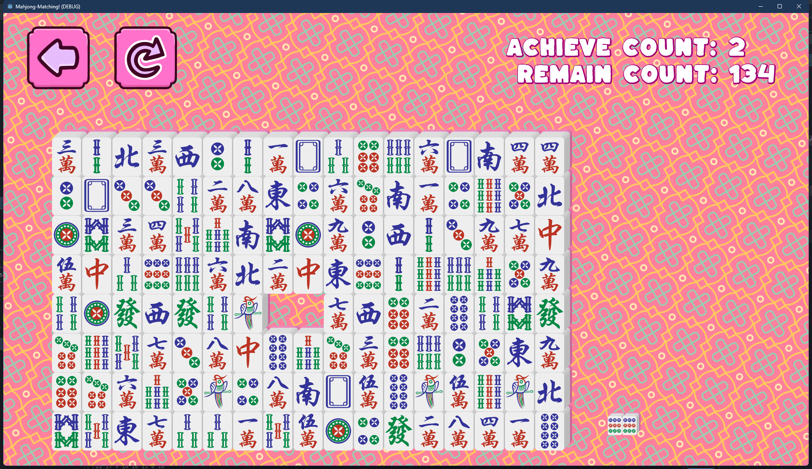

# 麻将对对碰
从朋友奶奶那里偷来的偷来的游戏玩法，在传统的对对碰上增加一些设定：

1. 仅允许相邻的牌消除；
2. 可以通过平移整行/整列来改变牌的位置。

## 更新日志
### 2024/04/18
- 基本实现2D效果，考虑到麻将的层级问题，后续改成3D的方案。

### 2024/05/06
修复了牌飞出边界的问题。

### 2024/05/10
修复可以连续拖拽多次的问题。

### 2024/05/15
- 简化游戏规则，删去拖拽规则；
- 修复BGM不能循环播放的问题；
- 修复窗口可以调整大小的问题。
